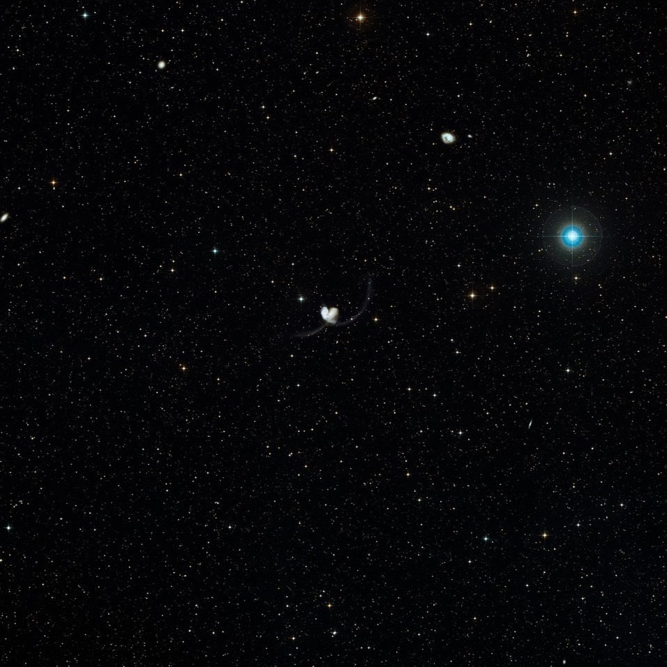
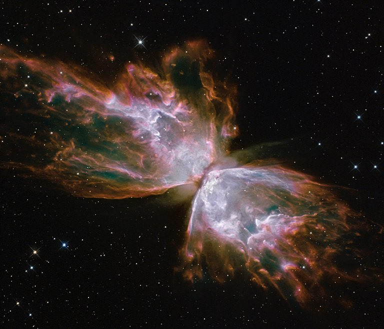
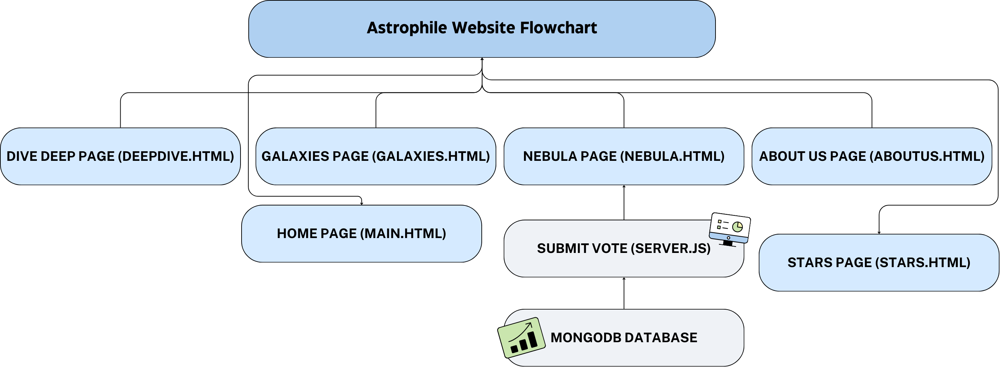

# 🌌Astrophile Website

## Overview

Astrophile is a visually engaging and informative website designed to educate users about various astronomical phenomena, including nebulae, stars, and galaxies. The website provides interactive content, detailed descriptions, and voting features to enhance user experience and participation.

### Features


- **🌟 Interactive Content**: Explore various nebulae, stars, and galaxies with interactive cards and detailed descriptions.
- **🗳️ Voting System**: Vote for your favorite nebula and see the results in real-time.
- **🎨 Custom Styling**: Visually appealing design with custom fonts and background images.
- **🧭 Smooth Navigation**: Easy-to-use navigation bar linking to different sections of the site.

### Setup

1. **📥 Clone the Repository**
   ```bash
   git clone https://github.com/yourusername/astrophile.git
   cd astrophile
   ```

2. **📦 Install Dependencies**
   ```bash
   npm install
   ```

3. **🚀 Start the Server**
   ```bash
   node server.js
   ```

4. **🌐 Access the Website**
   Open your browser and go to `http://localhost:3000`

### Technologies Used

- **🖥️Frontend**: HTML, CSS, JavaScript
- **🛠️Backend**: Node.js, Express.js
- **💾Database**: MongoDB

### Screenshots of the galaxies: 






### Site Flow Chart



### Future Work

- **🔭Expand Content**: Add more celestial objects and detailed descriptions.
- **👤User Accounts**: Implement user login and personalized features.
- **🖥️Interactive Visualizations**: Enhance interactive elements with 3D models and animations.

### Resources

- [🚀NASA](https://www.nasa.gov)
- [🔭Hubble Space Telescope](https://www.spacetelescope.org)
- [🌌Sky & Telescope](https://skyandtelescope.org)

### Team Members

- **🧑‍💻Juri Almukhizeem**
  - Senior Computer Science student with experience in data analysis, machine learning, and game development. Passionate about learning new skills and continuously growing.
  - 📧Email: juri2014muk@gmail.com

- **🧑‍💻Ghaida Alessa**
  - Enthusiast of space and astronomy since childhood. Passionate about crafting digital experiences related to space exploration.
  - 📧Email: gessa.1421@icloud.com

- **🧑‍💻Renad Aljumah**
  - Fascinated by stars, galaxies, and nebulas since childhood. Driven by curiosity and a desire to explore the universe.
  - 📧Email: renadaljumah@hotmail.com

---

## Detailed Documentation:

### fetchVotes.js Summary:

The `fetchVotes.js` connects to a MongoDB database, retrieves all documents from the `nobulaVote` collection within the `Vote` database, and prints the retrieved documents to the console. It handles potential errors during the process and ensures that the database connection is properly closed after the operation is completed.

### JSProject.js Summary:

The JavaScript code listens for the page load event and sets up click event listeners for six buttons on the webpage. When any of these buttons are clicked, a popup alert appears with the message "Are you ready to read more?".

### package-lock.json Summary:

The `package-lock.json` file ensures consistent dependency versions for the web project. It records the exact version of each dependency and their sub-dependencies that were installed, which helps in maintaining the integrity and reproducibility of the project across different environments.

### package.json Summary:

The `package.json` file specifies the project metadata, dependencies, and scripts necessary to manage the project with Node.js.

### server.js Summary:

The `server.js` file sets up an Express server that connects to a MongoDB database. It serves an HTML file and handles vote submissions by updating the vote count in the MongoDB collection.

### NodeJS Summary:

The `node_modules` folder contains all the dependencies and their sub-dependencies required for the web project. This directory is automatically generated by the Node Package Manager (npm) based on the specifications in the `package.json` and `package-lock.json` files.

---

## HTML Pages:

### DeepDive.html:

`DeepDive.html` provides an interactive and engaging experience for users to explore various nebulae and galaxies. Key features include custom styling, a navigation bar, an introduction section, interactive cards, hover effects, and smooth scrolling.

### Main.html:

`Main.html` is the main landing page for the "Astrophile" website. It serves as a gateway to explore various topics related to astronomy, including galaxies, stars, and nebulae. Key features include custom styling, a navigation bar, main content with interactive cards, a fixed footer, and responsive design.

### Nebula.html Summary:

`Nebula.html` is an informative and interactive web page that explores various nebulae, their characteristics, and the process of star formation within them. Key features include an introduction section, interactive cards, a voting section, and a fixed footer.

### AboutUs.html Summary:

`AboutUs.html` introduces the team behind the "Astrophile" website. It provides a brief overview of the team members, their passions, and contact information. Key features include an introduction section, team member profiles, and a fixed footer.

### Stars.html Summary:

`Stars.html` educates users about stars, their formation, lifecycle, and various fascinating stars in the universe. Key features include introduction sections, interactive cards, and a fixed footer.

### Galaxies.html Summary:

`Galaxies.html` educates users about galaxies, their shapes, and fascinating facts. Key features include introduction sections, interactive cards, and a fixed footer.

---
### Presentation:

You can view the presentation for this project [here](https://www.canva.com/design/DAGF4HJUcpk/1WFIS7WtUGaT9SN5s0OjdA/view?utm_content=DAGF4HJUcpk&utm_campaign=designshare&utm_medium=link&utm_source=editor).

### GitHub Repository:

You can access the GitHub repository for this project [here](https://github.com/Galaxy1421/webproject/tree/main).

